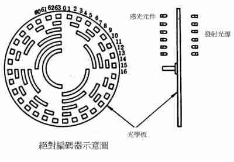

# 机器人文档<font size = 2> 2018.11.19 </font><!-- 请使用VScode等MarkDown编辑器预览 -->

_此文档为寻宝机器人竞赛工程说明文档._

## 待解决的问题
<电机控制>
电机控制板的反转问题。
电机控制层的设计。

<灰度传感器>
前中部分的灰度传感器，由于高度不同导致回传量大小不同。

## 目录
* [电机编码器](#电机编码器)
* [灰度传感器](#灰度传感器)
* [陀螺仪](#陀螺仪)

### 电机编码器
**编码器**<font color=#AAD28F size=2>(Encoder)</font> 用于反馈电机的转速。

通常编码器可以反馈电机的速度、转动的方向。转动的方向是通过编码器上的两个通道触发的先后次序决定的。如下图编码器原理所示，编码器最常用编码盘雕刻，在旋转时通过发射光源而让感光元件产生与编码盘上雕刻一致的角度位置的电信号。不过这里要提到的是，图上的编码方式是标准二进制的编码方式，数电上学到的**格雷码**<font color=#AAD28F size=2>（循环二进制单位距离码, Gray Code）</font>，就是为了保证传送讯号的正确性而发明的。

<div align=center></div>

我们使用的编码器<font color=#DFDFC0 size=2>(2018届)</font>集成在机器人的减速电机之上，也是通过光电信号反馈，通过反馈接收器的0-1信号的速度，来判断电机转速。也因此，编码器仅反馈0-1信号，需要外部寄存器保存一段时间内的触发的次数，我们使用STM32来充当这个寄存器，并且使用定时器捕获上升或下降沿的触发。

#### 模块私有变量
编码器模块采用C++编程思想，将对象（变量）进行封装，我们在编码器反馈模块中的变量主要是以下三个：
```C
/* Right Front encoder */
static uint32_t _speedValueRF = 0;  // 速度值,从中断函数中触发获得,在计算平均速度中有用
static uint8_t  _updateTimesRF = 0; // 更新次数,每次计算速度值时均会更新
static uint32_t _triggerCountRF = 0;// 触发总计,在转角度时会用到

/* Left Rear encoder */
static uint32_t _speedValueLR = 0;
static uint8_t  _updateTimesLR = 0;
static uint32_t _triggerCountLR = 0;
```

#### 定时器初始化
定时器初始化函数如下所示，在开启时钟、确认引脚配置、开启中断向量等基本配置后，要注意定时器的捕获模式，这里我们将定时器的时钟通过分频器分频为<font color=#839C85 size=3> 500KHz</font>，代码中<font color=#839C85 size=3> (_timerClock / 500000) - 1; </font>这样的写法，有助于阅读，因为只需要看到分母上的<font color=#839C85 size=3> 500000 </font>就能知道分频器的效果是什么了。

然后因为定时器是16位寄存器，我们通过设置ARR，使我们的寄存器每一次**溢出**<font color=#AAD28F size=2>（overflow）</font>都对应<font color=#839C85 size=3> 0.1s </font>如此可以方便计算定时器N次溢出后的总时间值。

```C
/** 
  * @brief  STM32定时器捕获初始化(Initialization of Timer-Input Capture)
  * @param  无输入参数
  * @retval 无返回参数
  */
void EncoderInit(void)
{ 
  TIM_TimeBaseInitTypeDef TIM_TimeBaseStructure;
  TIM_ICInitTypeDef TIM_ICInitStructure;
  NVIC_InitTypeDef NVIC_InitStructure;
  GPIO_InitTypeDef GPIO_InitStructure;
  
  /* 开启 TIM5, TIM2 以及 GPIOA 的时钟 ************************************/
  RCC_APB1PeriphClockCmd(RCC_APB1Periph_TIM2, ENABLE);
  RCC_APB1PeriphClockCmd(RCC_APB1Periph_TIM5, ENABLE);
  RCC_AHB1PeriphClockCmd(RCC_AHB1Periph_GPIOA, ENABLE);

  /* GPIO口 配置 *********************************************************/
  /* GPIO口 配置如下:
        - 引脚 -> PA0 & PA15 
        - 引脚复用(Alternate Function)模式 -> TIM5 CH1 & TIM2 CH1
        - 引脚速度 = 100MHz
        - 推拉(Push Pull)输出模式
        - 默认下拉
  */
  GPIO_PinAFConfig(GPIOA, GPIO_PinSource0, GPIO_AF_TIM5);
  GPIO_PinAFConfig(GPIOA, GPIO_PinSource15, GPIO_AF_TIM2);
  
  GPIO_InitStructure.GPIO_Pin = GPIO_Pin_0 | GPIO_Pin_15;
  GPIO_InitStructure.GPIO_Mode = GPIO_Mode_AF;
  GPIO_InitStructure.GPIO_Speed = GPIO_Speed_100MHz;
  GPIO_InitStructure.GPIO_OType = GPIO_OType_PP;
  GPIO_InitStructure.GPIO_PuPd = GPIO_PuPd_DOWN;
  GPIO_Init(GPIOA, &GPIO_InitStructure);                                

  /* 定时器基本寄存器配置 **************************************************/
  /* 定时器4 的基本寄存器配置如下:
        - 分频器(Prescaler) = _timerClock / 500000 等于 500KHz 的时钟
        - 向上计数模式
        - 自动加载寄存器值(Auto-Reload Register, ARR) = 50000 -> 0.1s满一次
        - 不分频系统时钟
     ## - 重复计数器(未使用)
  */
  TIM_TimeBaseStructure.TIM_Prescaler = (_timerClock / 500000) - 1;
  TIM_TimeBaseStructure.TIM_CounterMode = TIM_CounterMode_Up;
  TIM_TimeBaseStructure.TIM_Period = 50000 - 1;
  TIM_TimeBaseStructure.TIM_ClockDivision = TIM_CKD_DIV1;
  
  TIM_TimeBaseInit(TIM5, &TIM_TimeBaseStructure);
  TIM_TimeBaseInit(TIM2, &TIM_TimeBaseStructure);
  
  /* 定时器通道 1 配置为输入捕获模式 ***************************************/
  /* 定时器5的输入捕获模式如下:
        - 定时器5通道1
        - 上升沿信号捕获
        
                   CNT ^      N times overflow
                   ARR |___________________________
                       |         /     /     /        
                       |        /!    /!    /!    / 
                 CCRx1 |---/   / !   / !   / !   / 
                       |  /!  /  !  /  !  /  !  /  
                 CCRx2 |-/-!-/---!-/---!-/---!-/ 
                       |/  !/    !/    !/    !/!   
                 Timer |----------------------------> t
                       |   t1                  t2       [Input signal's frequency]
                     1 |   !_______            !____     = (N * ARR + CCRx2) * T
                       |   |       |           |
                       |   |       |           |          
                     0 |___|       |___________|
          Input signal |---------------------------->

     ** - 直接定时器比较（疑惑）
        - 没有输入捕获分频器
        - 过滤器设置 : 当采样高电平次数取到4次时，将这个采样高电平认为是一个输入信号（去干扰）
  */
  TIM_ICInitStructure.TIM_Channel = TIM_Channel_1;
  TIM_ICInitStructure.TIM_ICPolarity = TIM_ICPolarity_Rising;
  TIM_ICInitStructure.TIM_ICSelection = TIM_ICSelection_DirectTI;
  TIM_ICInitStructure.TIM_ICPrescaler = TIM_ICPSC_DIV1;
  TIM_ICInitStructure.TIM_ICFilter = 0x02;
  
  TIM_ICInit(TIM5, &TIM_ICInitStructure);
  TIM_ICInit(TIM2, &TIM_ICInitStructure);  
  
  /* 嵌套中断向量控制器配置 ***********************************************/
  /* 嵌套中断向量控制器配置如下:
        - 中断服务函数名称 = TIM5_IRQHandler & TIM2_IRQHandler
        - 占先式优先级 = 2 (较低)
     ** - 优先级水平 = 0 (非常高，疑惑)
        - 开启中断通道
  */  
  NVIC_InitStructure.NVIC_IRQChannel = TIM5_IRQn;
  NVIC_InitStructure.NVIC_IRQChannelPreemptionPriority = 2;
  NVIC_InitStructure.NVIC_IRQChannelSubPriority = 0;       
  NVIC_InitStructure.NVIC_IRQChannelCmd = ENABLE;           
  NVIC_Init(&NVIC_InitStructure);

  NVIC_InitStructure.NVIC_IRQChannel = TIM2_IRQn;
  NVIC_Init(&NVIC_InitStructure);

  TIM_Cmd(TIM5, ENABLE);
  TIM_Cmd(TIM2, ENABLE); 
}  
```
#### 周期计算方式

通过定时器确定一个周期运动的时间，有两种常用的方法，第一种是在定长时间内计算发生的**频次**<font color=#AAD28F size=2>（Frequency）</font>，第二种是计算一个**周期**<font color=#AAD28F size=2>（Period）</font>的时长。

工程<font color=#DFDFC0 size=2>(2018届)</font>中使用计算周期时长的方式。
```C
/**
  * @brief  这个函数是定时器5的中断请求句柄（Handle）
  * @param  无输入参数
  * @retval 无返回参数
  */
void TIM5_IRQHandler(void)
{
  _Timer5Capture_Interrupt();
}

/**
  * @brief  定时器5中断服务函数，按F12跳转至中断接口函数.
  * @param  无输入参数
  * @retval 无输出参数
  */
void _Timer5Capture_Interrupt(void)
{
  static uint8_t _timerOverFlow = 0;
  
  /* Timer5 Update (overflow) interrupt ***********************************/
  if(TIM_GetITStatus(TIM5, TIM_IT_Update) == SET) {
    if(_timerOverFlow++ < 10) {}
    else {
      _CaptureFrequency(TIM5, TIM_GetCapture1(TIM5), _timerOverFlow);
      _timerOverFlow = 0;
    }
    TIM_ClearITPendingBit(TIM5, TIM_IT_Update);
  }
  
  /* Timer5 Capture/Compare interrupt *************************************/  
  if(TIM_GetITStatus(TIM5, TIM_IT_CC1) == SET) {
    _CaptureFrequency(TIM5, TIM_GetCapture1(TIM5), _timerOverFlow);
    _timerOverFlow = 0;
    _triggerCountRF ++;
    TIM_SetCounter(TIM5, 0);
    TIM_ClearITPendingBit(TIM5, TIM_IT_CC1);
  }
}
```
工程<font color=#DFDFC0 size=2>(2018届)</font>设计上将中断接收函数和中断主函数通过函数调用的方式放置在两个不同的文件中，通过这样的方式减弱不同文件之间的耦合程度，并且使单个.c或者.h文件更加独立。

中断函数主要对硬件的中断信号进行处理而设计的，在Linux中称为“信号”，在Windows中虽然没有中断（中断被底层隐藏了），但是却有“消息”，那么无论是“信号”，还是“消息”，在STM32的这个中断主函数中，我们就处理了两类中断，分别是定时器**更新中断以**<font color=#AAD28F size=2>（Update interrupt）</font>及定时器**比较/触发中断**<font color=#AAD28F size=2>（Capture/Compare interrupt）</font>，函数中<font color=#839C85 size=3> static uint8_t _timerOverFlow = 0; </font>用于声明我们的一个溢出次数变量，并且限制其作用域仅在这个函数之内，加上<font color=#839C85 size=3>static</font>限定其生存周期。在中断函数中声明仅在中断中使用的变量是个很好的习惯，它可以让工程中的变量使用范围明确以及作用清晰，虽然对不少新手来说这样的声明会带来许多麻烦和可能的错误，但是我们相信，这样的写法总比在文件开头定义一大堆变量来的清晰和可靠。

我们希望在周期信号的每一个上升沿将信号捕获，并开始计时，在第二个上升沿保存计时，并开启下一次计时。很明显，在捕获中断条件下，函数执行的步骤从上到下为计算时间、初始化、清除中断标志位。<font color=#839C85 size=3> _triggerCountRF </font>是在[另一个函数中](#速度检测部分)使用的变量。

为了配合两次捕获信号的函数，我们还设置了一个更新中断，由于我们设置的自动加载值为0.1s，所以寄存器的值只能从0~0.1s，为了扩大时域，我们采用溢出的方式来计算频率比较慢的触发。并且因为有这个中断的存在，我们可以在长时间（这里是1s内）没有接收到第二个上升沿信号时，可以强制让[速度检测函数](#速度检测部分)退出识别。

#### 速度检测部分
获取电机速度反馈是我们这个部分的最终目标。从[上面](#周期计算方式)可以知道，我们将电机转速通过计算一个周期的时间来判断其速度。

```c
/**
  * @brief  获取右前方电机的速度
  * @param  nTimesAverage: 函数内取N次平均
  * @retval 右前方电机的转速,单位是 多少寄存器值每周期
  */
uint32_t GetRFSpeed(uint8_t nTimesAverage)
{
  uint32_t totalSpeed = 0;
  _updateTimesRF = 0;
  
  TIM_ClearITPendingBit(TIM5, TIM_IT_CC1 | TIM_IT_Update);
  TIM_ITConfig(TIM5, TIM_IT_Update | TIM_IT_CC1, ENABLE);
  
  for(int times = 1; times <= nTimesAverage; times++)
  {
    while(_updateTimesRF <= times) {}
    totalSpeed += _speedValueRF;
  }
  
  TIM_ITConfig(TIM5, TIM_IT_Update | TIM_IT_CC1, DISABLE);
  return ( totalSpeed / nTimesAverage );
}
```
函数中
```c
TIM_ClearITPendingBit(TIM5, TIM_IT_CC1 | TIM_IT_Update); 
TIM_ITConfig(TIM5, TIM_IT_Update | TIM_IT_CC1, ENABLE); 

TIM_ITConfig(TIM5, TIM_IT_Update | TIM_IT_CC1, DISABLE); 
```
这三句话分别是初始化中断标志位，开启中断和关闭中断，在函数中间部分，第一个循环表示了我们一共要做多少次采样，以满足最后的值是一个N次采样平均值。而第二个while循环则是等待中断完成对速度的采样处理，这个部分可以理解为线程阻塞，等待另一个线程进行同步。<font color=#839C85 size=3> _updateTimesRF & _speedValueRF </font> 这两个值，是在[周期运算函数](#周期运算函数)中变更的.

#### 周期运算函数
```c
/**
  * @brief  周期时间运算函数
  * @param  TIMx: 定时器x
  *         captureNum: 定时寄存器值（CCR）
  *         timerOverFlow: 溢出次数
  * @retval 无返回值
  */
void _CaptureFrequency(TIM_TypeDef* TIMx, uint32_t captureNum, uint8_t timerOverFlow)
{
  if(TIMx == TIM5)
  {
    if(timerOverFlow >= 10) {
      _updateTimesRF = 0xff;
      _speedValueRF = 0;
      return;
    }
    _speedValueRF = timerOverFlow * 50000 + captureNum;
    _updateTimesRF++;
  }
  else if(TIMx == TIM2)
  {
    if(timerOverFlow >= 10) {
      _updateTimesLR = 0xff;
      _speedValueLR = 0;
      return;
    }
    _speedValueLR = timerOverFlow * 50000 + captureNum;
    _updateTimesLR++;
  }
}
```
可以发现对于定时器5还是定时器2，两者的处理方式是一样的。当然此函数还有进一步优化的可能，通常在处理同样类型的数据时，并不会用IF-ELSE结构来区分不同的模块，而是采用一个宏来定义两个模块，如上面代码中的TIMx，再通过数组来实现不同定时器的数据分组。

从代码中可以看到，速度值的计算方式是 **溢出次数 X 50000 + CCR** 再更新速度值后，紧接着更新了速度的更新次数值<font color=#839C85 size=3> _updateTimesRF </font>，这里要提到的是，假设系统没有控制电机，而导致电机没有转动，那么这个程序将会阻塞——因为没有第二次触发导致主程序一直在等待触发。所以若我们从[中断服务函数](#周期计算方式)中知道定时器已经溢出了10次，也就是1s内都没有第二次触发，将强制进入这个 **周期时间运算函数** 并将 **更新次数值**<font color=#839C85 size=3> _updateTimesRF </font> 设置为最大值 0XFF 从而让 **速度检测部分** 跳出阻塞。

#### 最后的话
虽然这个程序通过主线程开启中断并阻塞等待、中断响应并调用计算的方式完成了编码器的反馈，可依旧存在一些小问题。

这个模块中还有着 <font color=#839C85 size=3> WaittingTrigger </font> 这种用在转角度时使用的函数，这里暂时没有介绍，因为转角度原本是陀螺仪的事情，只是当时陀螺仪在使用上遇到了一些问题，而采用这种凑的方式来应付竞赛，编码器部分先记录到这里，因为是工程文档，希望阅读的工程人员能够提出一些宝贵建议，来帮助这个工程文档更加的专业、清晰。

### 灰度传感器

### 陀螺仪
